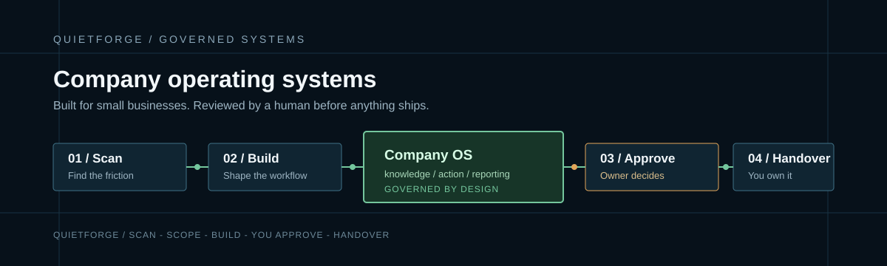

# Norbert Wozniak | QuietForge

## Conversion Systems Architect

I build governed company operating systems for small businesses: quote and order
flows, inbox operations, company knowledge and reporting.

QuietForge is the commercial implementation studio. The working path is:

**Scan -> scope -> build -> you approve -> handover**

AI helps me build quickly. Engineering review, security controls and human approval
decide what ships.

## Start here

- [Visit QuietForge](https://quietforge.flexgrafik.nl/)
- [Explore the Builder's Lab](https://quietforge.flexgrafik.nl/lab/)
- [Read the proof boundary](https://quietforge.flexgrafik.nl/proof/)
- [Book an Automation Scan](https://quietforge.flexgrafik.nl/book-a-scan/)

## What I build

- Systems that qualify leads and structure the next action.
- Company knowledge and operating maps that reduce information drift.
- Supervised workflows for quotes, orders, inboxes and reporting.
- Delivery with review gates, documentation and repository handover.

## How to read this GitHub

This account is an evidence layer for QuietForge, not a free product catalogue.
Public visibility does not grant a licence or imply free commercial reuse.

Every repository should state its role, readiness, proof tier, ownership boundary,
security posture and last verification date before it is presented as public proof.

## Curated repository map

| Repository | Role | Evidence boundary |
|---|---|---|
| [dsaas-quietforge](https://github.com/wozniaknorbert95-del/dsaas-quietforge) | Public tenant reference | Shows a live QuietForge site and owner-operated build work; it is not the reusable platform core or a free product. |
| [Builder's Lab](https://quietforge.flexgrafik.nl/lab/) | Primary technical proof | Explains the build laboratory, sanitized evidence and tenant/platform boundaries. |
| Public proof repositories | In review | Repositories are pinned only after sanitization, README, security and IP review. |

## Proof boundaries

- **PROVEN**: reproducible technical evidence or a measured result with a traceable source.
- **DEMO**: deliberate fixture, walkthrough or controlled demonstration.
- **PLANNED**: future work without public proof.
- **OWNER-OPERATED REFERENCE**: FlexGrafik work used to show that systems were built; it is not an external client case study.

I do not claim client ROI, market traction, full autonomy or external client delivery
without the corresponding evidence.

## Security and delivery

- Secrets stay outside repositories and are rotated after historical exposure.
- Public proof is sanitized: no tenant data, PII, internal hosts, local paths or tokens.
- Changes pass review, dependency checks and explicit approval gates.
- Client-specific code and data are handed over according to the agreed contract;
  reusable QuietForge framework and platform IP remain separate unless assigned.

## Maintainer

Norbert Wozniak | QuietForge

Last inventory review: 2026-09-06

Next review: after each meaningful public proof release, and monthly during the first quarter.
